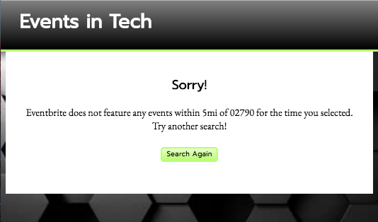

# Events In Tech

A discovery application. Users can search for live Science and Technology events in their area. 

[See a live Preview Here](http://htmlpreview.github.io/?https://github.com/amyspeed/EventsInTech/blob/master/index.html)

## Landing Page
Users are introduced to the application and invited to enter. They can also see and link to three major technology news stories.

## Search Page
Users are directed to the major search form of the application. They can choose from a long list of major cities or enter their own specific location. The user is required to enter a location in one of these two ways to submit the form. Otherwise, an error will be alerted. The user can also specify distance, time period, sorting parameters, and max results.

## Results Page
Powered by the eventbrite API, events in the users' specified locations and times are appended to the page. Users can view a title, photo, truncated description, and a URL. They can link to the event in a new tab to take further action. The "Search Again!" buttons redirect to a cleared Search Page.

## No-Results Page
Users are directed to this page if there are no events in their specified location and time. They can try the search again by linking back to the Search Page.

## Technologies
*HTML
*CSS- ** Including media queries
*JavaScript- ** Including the use of third-party APIs
*jQuery

## Author
Amy Speed-Henley